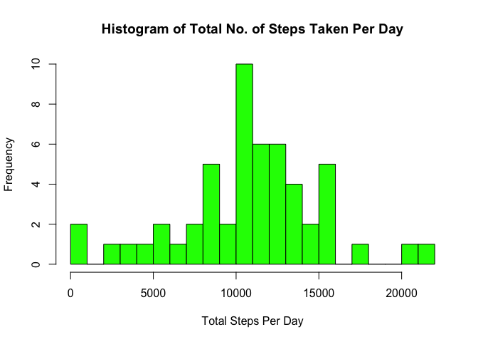
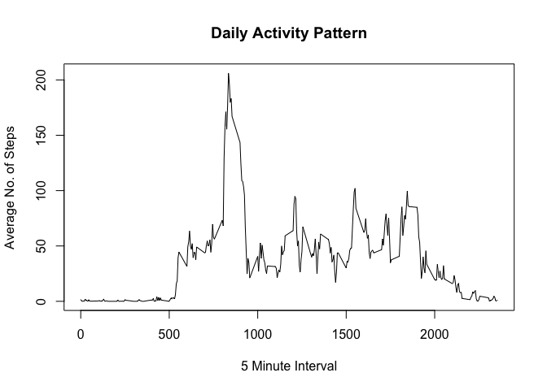
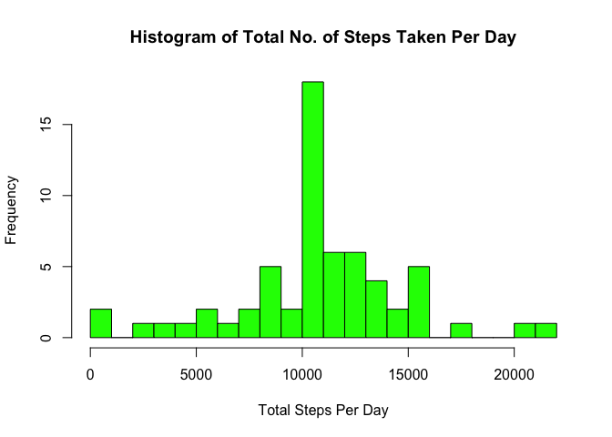
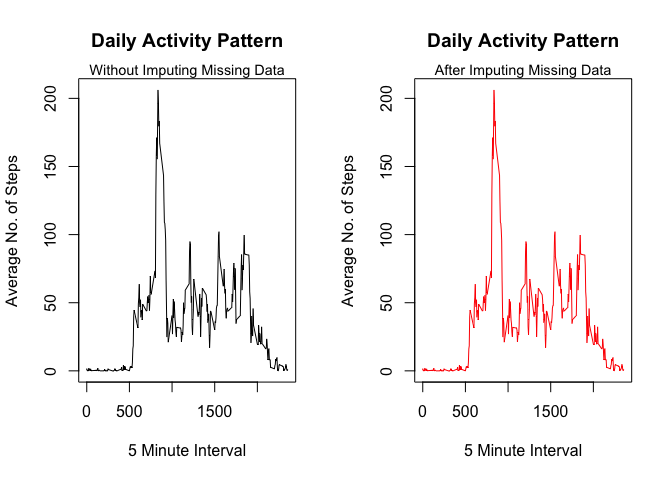

# Reproducible Research: Peer Assessment 1
Abhey Kumar  
6/9/2017  

## 1. Loading and preprocessing the data

The only transformation considered necessary is to convert the date variable from character to Date class.


```r
activity <- read.csv("activity.csv")
activity$date <- as.Date(as.character(activity$date), "%Y-%m-%d")
str(activity)
```

```
## 'data.frame':	17568 obs. of  3 variables:
##  $ steps   : int  NA NA NA NA NA NA NA NA NA NA ...
##  $ date    : Date, format: "2012-10-01" "2012-10-01" ...
##  $ interval: int  0 5 10 15 20 25 30 35 40 45 ...
```

## 2. What is mean total number of steps taken per day?

### 2.1 Make a histogram of the total number of steps taken each day.

As per the directions, the histogram is as below.


```r
stepsperday <- aggregate(steps ~ date, data = activity, sum, na.rem = TRUE)
hist(stepsperday$steps, main = "Histogram of Total No. of Steps Taken Per Day", xlab = "Total Steps Per Day", breaks = 20, col = "green")
```

<!-- -->

## 2.2 Make a histogram of the total number of steps taken each day.

So, we calculate the mean and the median of the total number of steps per day.


```r
options(scipen = 999)
meansteps <- round(mean(stepsperday$steps))
meansteps
```

```
## [1] 10767
```

```r
mediansteps <- round(median(stepsperday$steps))
mediansteps
```

```
## [1] 10766
```

The (rounded off) mean of total number of steps taken per day is 10767 steps and the median of total number of steps taken per day is 10766 steps.

## 3. What is the average daily activity pattern?

### 3.1 Make a time series plot of the 5-minute interval (x-axis) and the average number of steps taken, averaged across all days (y-axis).


```r
intervalsteps <- aggregate(steps ~ interval, data = activity, mean, na.rm = TRUE)
plot(intervalsteps, type = "l", main = "Daily Activity Pattern", xlab = "5 Minute Interval", ylab = "Average No. of Steps")
```

<!-- -->

### 3.2 Which 5-minute interval, on average across all the days in the dataset, contains the maximum number of steps?


```r
interval <- intervalsteps$interval[which.max(intervalsteps$steps)]
interval
```

```
## [1] 835
```

The 5-Minute interval 835 contains the maximum number of steps, on average across all the days in the dataset.

## 4. Imputing missing values

### 4.1 Calculate and report the total number of missing values in the dataset (i.e. the total number of rows with NAs).


```r
missval <- sum(is.na(activity$steps))
missval
```

```
## [1] 2304
```

```r
percent <- round((missval/nrow(activity)*100))
```

There are 2304 rows in the data set that have NAs, which is about 13% of the rows in the data set.


### 4.2 Devise a strategy for filling in all of the missing values in the dataset.

It was decided to replace the NA values by the average steps of the same 5-Minute interval.

### 4.3 Create a new dataset that is equal to the original dataset but with the missing data filled in.

The following code will replace all NAs with the average total number of steps of the same 5-Minute interval. As a confirmation of the accuracy of the code, it will return the number of rows with NA values (i.e. zero).


```r
activityrefined <- activity
for (i in 1:nrow(activityrefined)){
  if (is.na(activityrefined$steps[i])){
    activityrefined$steps[i] <- intervalsteps$steps[intervalsteps$interval == activityrefined$interval[i]]
  }
}
sum(is.na(activityrefined$steps))
```

```
## [1] 0
```

## 4.4 Make a histogram of the total number of steps taken each day and Calculate and report the mean and median total number of steps taken per day. Do these values differ from the estimates from the first part of the assignment? What is the impact of imputing missing data on the estimates of the total daily number of steps?

The histogram of the total number of steps taken each day:


```r
newstepsperday <- aggregate(steps ~ date, data = activityrefined, sum)
hist(newstepsperday$steps, main = "Histogram of Total No. of Steps Taken Per Day", xlab = "Total Steps Per Day", breaks = 20, col = "green")
```

<!-- -->

Now we calculate the mean and the median of the total number of steps per day in the new data set.


```r
options(scipen = 999)
newmeansteps <- round(mean(newstepsperday$steps))
newmediansteps <- round(median(newstepsperday$steps))
```

The (rounded off) mean of total number of steps taken per day is 10766 steps and the median of total number of steps taken per day is 10766 steps. As the average 5-Minute interval values were used to replace the NAs, it was not expected to change the mean and median values significantly.

The impact of imputing the missing data can be visualised by the plot below. As is clearly visible, there has been no overal significant impact on the daily activity pattern.


```r
par(mfrow = c(1,2))
plot(intervalsteps, type = "l", main = "Daily Activity Pattern", xlab = "5 Minute Interval", ylab = "Average No. of Steps")
mtext("Without Imputing Missing Data", cex = 0.9, line = 0)
newintervalsteps <- aggregate(steps ~ interval, data = activityrefined, mean)
plot(newintervalsteps, type = "l", main = "Daily Activity Pattern", xlab = "5 Minute Interval", ylab = "Average No. of Steps", pch = 4, col = "red")
mtext("After Imputing Missing Data", cex = 0.9, line = 0)
```

<!-- -->


## 5. Are there differences in activity patterns between weekdays and weekends?

### 5.1 Create a new factor variable in the dataset with two levels: 'weekday' and 'weekend', indicating whether a given date is a weekday or weekend day.


```r
activityrefined$daytype <- ifelse(weekdays(activityrefined$date) %in% c("Saturday", "Sunday"), "weekend", "weekday")
activityrefined$daytype <- as.factor(activityrefined$daytype)
str(activityrefined)
```

```
## 'data.frame':	17568 obs. of  4 variables:
##  $ steps   : num  1.717 0.3396 0.1321 0.1509 0.0755 ...
##  $ date    : Date, format: "2012-10-01" "2012-10-01" ...
##  $ interval: int  0 5 10 15 20 25 30 35 40 45 ...
##  $ daytype : Factor w/ 2 levels "weekday","weekend": 1 1 1 1 1 1 1 1 1 1 ...
```

### 5.2 Make a panel plot containing a time series plot of the 5-minute interval (x-axis) and the average number of steps taken, averaged across all weekday days or weekend days (y-axis). 

This was plotted by the lattice plotting system.


```r
library(lattice)
plotdata <- aggregate (activityrefined$steps, list (day = activityrefined$daytype, interval = activityrefined$interval), mean)
xyplot(x ~ interval | day, data = plotdata, type = "l", layout = c(1,2), xlab = "Interval", ylab = "Number of Steps")
```

<!-- -->

End of assignment report.
